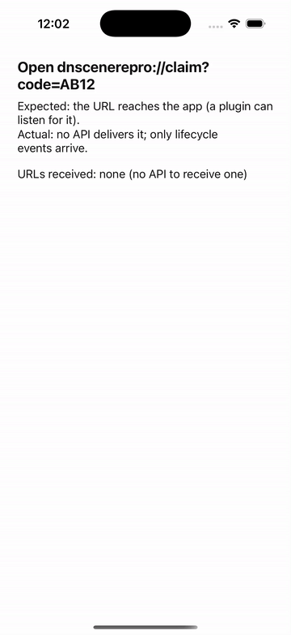

# Repro: iOS plugins can't receive scene events (opened URLs, Universal Links)

`ios/Runner/Info.plist` registers the `dnscenerepro` URL scheme. When the app
is opened with a URL, iOS calls `scene(_:openURLContexts:)` (custom scheme) or
`scene(_:continue:)` (Universal Link) on the scene delegate, and
`connectionOptions.urlContexts` / `.userActivities` carry it on a cold start.
`DartNativeSceneDelegate` implements only `scene(_:willConnectTo:options:)`,
and an iOS plugin (`ffiPlugin: true`) has no registrar or listener API, so
neither the app nor a plugin can get that URL without swizzling the delegate.
Android has `DNActivityEvents.addIntentListener` for the same thing.

## Run

1. `dn run` (iOS simulator).
2. With the app on screen:

   ```sh
   xcrun simctl openurl booted 'dnscenerepro://claim?code=AB12'
   ```

## What you'll see

iOS hands the URL to the app (it stays in front; lifecycle events arrive), but
nothing in Dart or any plugin can receive it: the screen keeps showing
"URLs received: none".

## Expected

An iOS counterpart of `DNActivityEvents` that `DartNativeSceneDelegate`
forwards to, for example:

```swift
DNSceneEvents.addWillConnectListener { scene, session, options in … }
DNSceneEvents.addOpenURLContextsListener { scene, contexts in … }
DNSceneEvents.addContinueUserActivityListener { scene, activity in … }
```

with the cold-start payload replayed to listeners added later.

## Recording



## Environment

- DartNative 1.0.0 (SDK `113c27aacb2`, framework edition `7ae29132`), Dart 3.12.0
- macOS 26.7.1, Xcode 26.1.1
- iPhone 17 simulator, iOS 26.1
